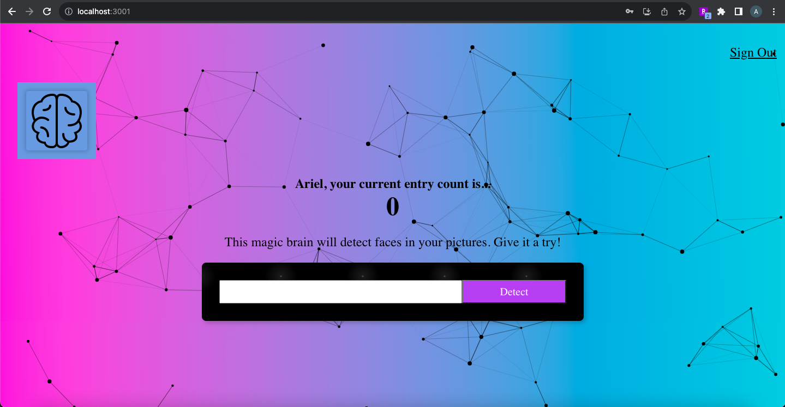
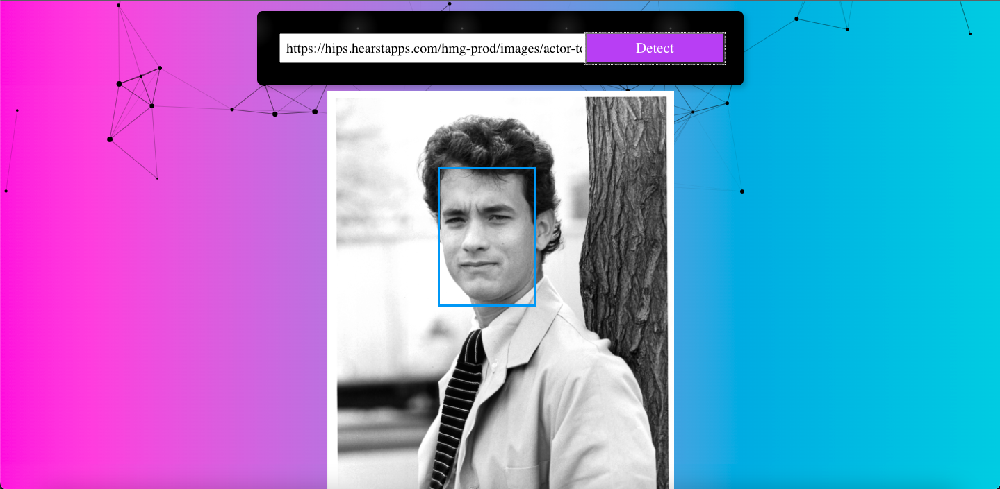
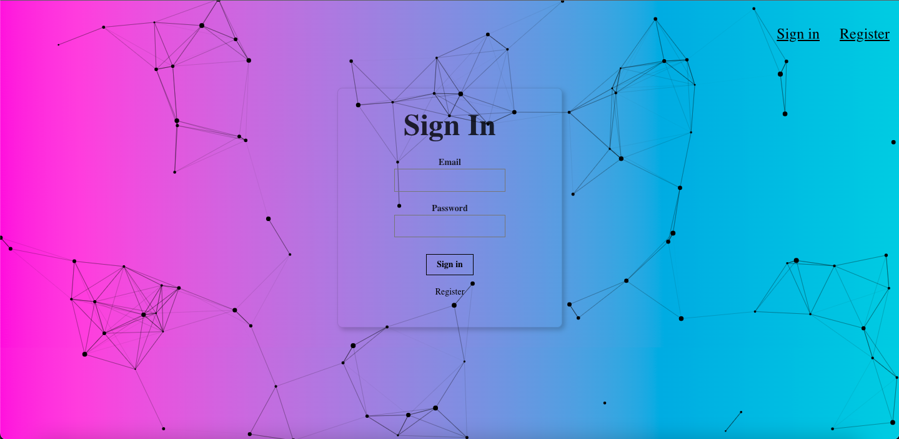
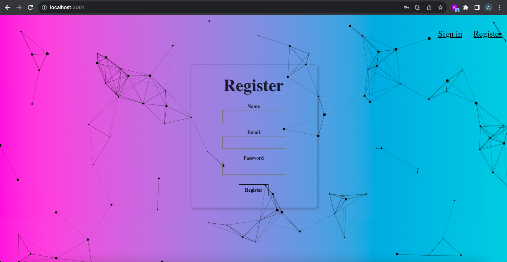

# Face Recognition App

This is a full-stack application where users can register and login to create a facial recognition profile. They can then upload images to identify faces using machine learning.

View the server repository [here](https://github.com/Ariel-Schwartz-254/face-recognition-brain-api/)

## Features

- User registration and login
- Insert URL of image to detect faces 
- Face Detection using [Clarifai API](https://clarifai.com/clarifai/main/models/face-detection)
- Tracking number of user image uploads

## Technologies

- React
- Clarifai API - Computer vision API for facial recognition
- NodeJS
- ExpressJS
- PostgreSQL
- Knex.js

## Limitations
- Image URL must be less than 80 characters 

## Screenshots

Main Page

Paste an image URL into the searchbar

The image will load, the machine learning model will detect any faces in the image and a blue box will be placed over the face area.

The user will now have an updated entry count on their profile

Sign in page

Register new users

